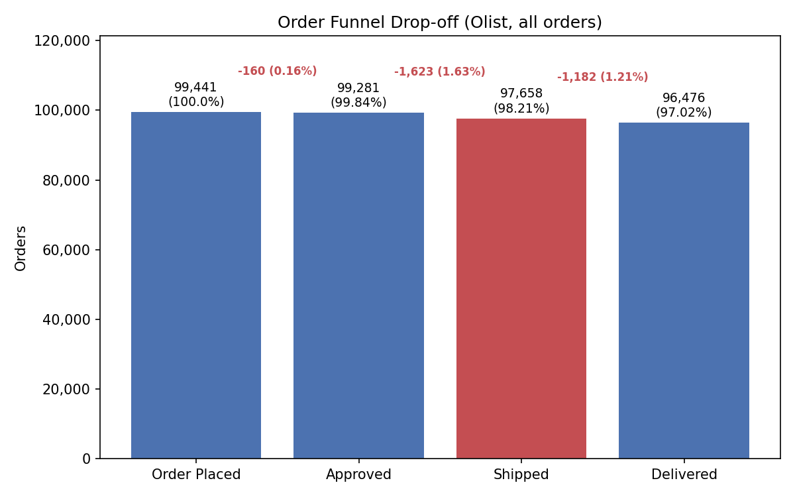
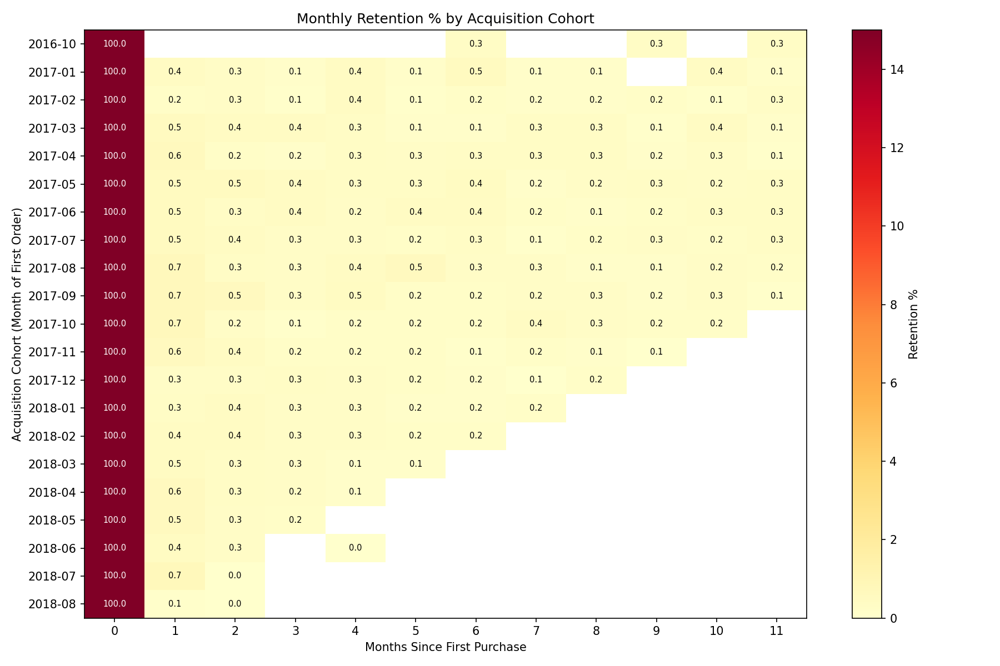
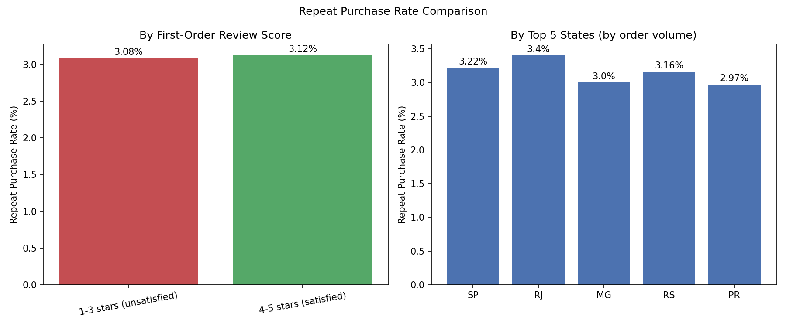

# Olist E-Commerce: Funnel & Cohort Retention Analysis

A SQL-driven analysis of order fulfillment and customer retention on the Olist
Brazilian e-commerce marketplace, built to demonstrate the funnel analysis, cohort
analysis, and SQL skills used day-to-day by a Product / Growth Analyst.

## Business Question

Two questions a growth team would actually ask about this business:

1. **Where in order fulfillment are we losing orders, and where's the biggest leak?**
2. **Do customers come back? And if not, is it because they had a bad experience,
   or is something more structural going on?**

## TL;DR Findings

| # | Question | Finding |
|---|---|---|
| 1 | Where's the biggest funnel leak? | **Approved → Shipped**: 1,623 orders (1.63%) never get a carrier hand-off — the single biggest drop of any stage, 4x the approval-stage drop rate. |
| 2 | Do customers come back? | **Almost never.** Only **3.12%** of customers (2,997 of 96,096) ever place a second order across the full 2-year dataset. Month-1 retention for any cohort is under 1%. |
| 3 | Does satisfaction drive repeat purchase? | **Barely.** 1-3 star first-order customers repeat at 3.07%; 4-5 star customers repeat at 3.12% — a 0.05pp gap. Service quality is not the retention lever here. |
| 4 | Which market is strongest? | **Rio de Janeiro (RJ)**: highest repeat rate (3.40%) *and* highest average order value (R$166.85). **Paraná (PR)** is weakest on both (2.97%, R$160.78). São Paulo drives 3x the volume of any other state but has the *lowest* average order value (R$143.69). |

## Methodology

All analysis logic — the funnel math, the cohort retention calculation, the
behavioral segmentation, the geographic rollups — is written as SQL and executed
directly against the raw CSVs with [DuckDB](https://duckdb.org/), which can query
CSV files in place with no database server or load step. Python/pandas/matplotlib
are used only downstream, to run the `.sql` files and turn the resulting tables
into charts — no pandas groupby/pivot logic stands in for the actual analysis.

**Join keys** (confirmed by inspecting the raw files before writing any query):
- `orders.order_id` ↔ `reviews.order_id` / `payments.order_id`
- `orders.customer_id` ↔ `customers.customer_id` — note `customer_id` is
  **per-order**, not per-customer (99,441 distinct values = number of rows). Every
  query that needs to identify a *repeat customer* uses `customers.customer_unique_id`
  instead (96,096 distinct values), which is the actual person/account across orders.
- `payments.order_id` has multiple rows per order (installments), so order value
  is `SUM(payment_value) GROUP BY order_id`.

**Data quality note:** 547 orders in the reviews file had duplicate review rows
(202 with genuinely conflicting scores). These were deduplicated to the most
recent review per order before joining, to avoid double-counting customers or
assigning them to the wrong review-score group.

**Scope decisions:**
- The funnel (`sql/01_order_funnel.sql`) uses the four timestamp columns in
  `orders` (`order_purchase_timestamp`, `order_approved_at`,
  `order_delivered_carrier_date`, `order_delivered_customer_date`) rather than
  `order_status` alone. `order_status` is a single terminal snapshot per order
  (e.g. a `canceled` order that had already shipped won't show "shipped" in
  `order_status`), so the timestamps are the reliable signal for how far an
  order actually progressed.
- Cohort retention counts a customer as "retained" in a given month if they
  placed *any* order that month, not specifically their second order — this is
  the standard cohort-retention definition and is what the heatmap visualizes.

## 1. Order Funnel

[sql/01_order_funnel.sql](sql/01_order_funnel.sql)



| Stage | Orders | % of Total | Drop-off | Drop-off % of Prev Stage |
|---|---|---|---|---|
| Order Placed | 99,441 | 100.00% | — | — |
| Approved | 99,281 | 99.84% | 160 | 0.16% |
| Shipped | 97,658 | 98.21% | 1,623 | **1.63%** |
| Delivered | 96,476 | 97.02% | 1,182 | 1.21% |

**Biggest leak: Approved → Shipped.** Once an order is approved, it has the
highest chance of any stage of never reaching a carrier. In absolute terms this
is also the largest single loss (1,623 orders) of the three transitions. The
overall funnel is healthy — 97% of all placed orders make it to delivery — but
this one stage stands out as the place to investigate first (fulfillment center
capacity, seller stock-outs, or payment-to-fulfillment handoff delays are the
usual suspects for this exact pattern in marketplace data).

## 2. Cohort Retention

[sql/02_cohort_retention.sql](sql/02_cohort_retention.sql)



Customers are grouped into a monthly acquisition cohort by the month of their
first order (`customer_unique_id`), then for each cohort we track what % of the
original cohort placed *any* order in each subsequent month — computed with a
self-join plus `DATEDIFF`/`DATE_TRUNC`, not a pandas pivot. Cohorts with under
100 customers (the first two and last two months of the dataset) are excluded
from the heatmap as statistically noisy.

**Retention collapses almost immediately.** Month-1 retention across every
cohort from 2017-01 through 2018-08 sits between **0.1% and 0.7%** — regardless
of acquisition month, almost nobody places a second order in the following
month. Zoomed out to the full ~2-year window, only **3.12%** of all customers
(2,997 of 96,096) ever place a second order at all
([sql/05_overall_repeat_rate.sql](sql/05_overall_repeat_rate.sql)).

This is a real structural characteristic of the Olist marketplace, not a data
artifact — many of the categories sold (furniture, large appliances, home
goods) are naturally one-time or low-frequency purchases.

## 3. Behavioral Cohort: Does Satisfaction Drive Repeat Purchase?

[sql/03_review_score_cohort.sql](sql/03_review_score_cohort.sql)

Customers are split by their **first order's** review score into 4-5 stars
(satisfied) vs. 1-3 stars (unsatisfied), then compared on repeat-purchase rate.

| Group | Customers | Repeat Customers | Repeat Purchase Rate |
|---|---|---|---|
| 1-3 stars (unsatisfied) | 21,887 | 672 | 3.07% |
| 4-5 stars (satisfied) | 73,473 | 2,296 | 3.12% |

**Satisfaction on the first order is not the retention lever.** The gap between
happy and unhappy customers is 0.05 percentage points — statistically and
practically negligible against a 3.1% baseline. This reframes the retention
problem: it isn't a service-quality issue that CX or logistics fixes can solve.
It's structural — most Olist purchases are one-and-done by category, and no
amount of delivery-experience polish will turn a mattress buyer into a repeat
customer next month.

## 4. Geography Segmentation

[sql/04_geo_segmentation.sql](sql/04_geo_segmentation.sql)



Top 5 states by order volume, comparing repeat-purchase rate and average order
value (`SUM(payment_value)` per order):

| State | Orders | Customers | Repeat Rate | Avg Order Value |
|---|---|---|---|---|
| SP (São Paulo) | 41,746 | 40,302 | 3.22% | R$143.69 |
| RJ (Rio de Janeiro) | 12,852 | 12,384 | **3.40%** ⭐ | **R$166.85** ⭐ |
| MG (Minas Gerais) | 11,635 | 11,259 | 3.00% | R$160.92 |
| RS (Rio Grande do Sul) | 5,466 | 5,277 | 3.16% | R$162.99 |
| PR (Paraná) | 5,045 | 4,882 | 2.97% ▼ | R$160.78 |

**RJ is the strongest segment** on both dimensions — highest repeat rate and
highest average order value. **PR is the weakest** on both. **SP is a volume
outlier**: it drives more than 3x the order count of any other state, but has
the lowest average order value of the top 5 — a high-frequency, lower-basket
market, in contrast to RJ's smaller but higher-value, more loyal base.

## Recommendation

A stakeholder can act on this today: **stop treating retention as a
service-quality problem and start treating it as a fulfillment-speed and
market-mix problem.** Concretely:

1. **Fix the Approved → Shipped handoff.** This is the single largest,
   directly-actionable leak in the funnel (1,623 orders, 1.63%). Since delivery
   experience doesn't move repeat-purchase behavior (Finding 3), the ROI case
   for fixing this stage is about the ~1,600 orders it recovers directly, not
   about retention — don't oversell it as a retention fix.
2. **Don't fund CX/satisfaction initiatives expecting a retention lift** — the
   4-5 vs 1-3 star gap (0.05pp) shows satisfaction isn't the retention lever in
   this marketplace. Retention gains are more likely to come from expanding
   into repeat-purchase-friendly categories (consumables, accessories) than from
   polishing the one-time furniture/appliance experience.
3. **Double down on RJ's playbook.** RJ beats every other top-5 state on both
   loyalty and basket size — worth understanding what's different about that
   market (seller mix, category mix, delivery speed) and testing whether it
   transfers to PR, the weakest segment on both metrics.

## Tech Stack

- **DuckDB** — all analysis logic (funnel, cohort retention, behavioral and
  geographic segmentation), queried directly against CSVs, no server or ETL step
- **Python / pandas / matplotlib** — chart generation only, downstream of the SQL
- **Jupyter** — orchestration notebook (`notebooks/analysis.ipynb`)

## Data Source

[Olist Brazilian E-Commerce Public Dataset](https://www.kaggle.com/datasets/olistbr/brazilian-ecommerce)
(Kaggle), covering ~100k orders placed on the Olist marketplace between
September 2016 and October 2018. Four of the nine files in the original dataset
are used here: `orders`, `customers`, `order_reviews`, and `order_payments`.

## Reproduce Locally

```bash
git clone <this-repo-url>
cd ecommerce-funnel-cohort-analysis
python3 -m venv venv
source venv/bin/activate        # Windows: venv\Scripts\activate
pip install -r requirements.txt

# Place the 4 Olist CSVs in data/ if not already present:
#   data/olist_orders_dataset.csv
#   data/olist_customers_dataset.csv
#   data/olist_order_reviews_dataset.csv
#   data/olist_order_payments_dataset.csv

jupyter nbconvert --to notebook --execute --inplace notebooks/analysis.ipynb
```

This regenerates all three charts in `images/` and reruns every SQL query in
`sql/` fresh against the raw CSVs. Verified to run top-to-bottom with zero
errors in a clean virtual environment.

## Project Structure

```
├── data/                          # Raw Olist CSVs (orders, customers, reviews, payments)
├── sql/
│   ├── 01_order_funnel.sql
│   ├── 02_cohort_retention.sql
│   ├── 03_review_score_cohort.sql
│   ├── 04_geo_segmentation.sql
│   └── 05_overall_repeat_rate.sql
├── notebooks/
│   └── analysis.ipynb             # Runs the SQL via DuckDB, generates charts
├── images/                        # Exported PNG charts (embedded above)
├── requirements.txt
└── README.md
```
